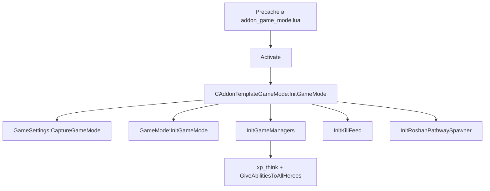
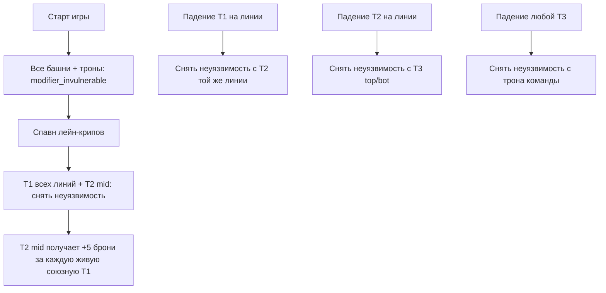
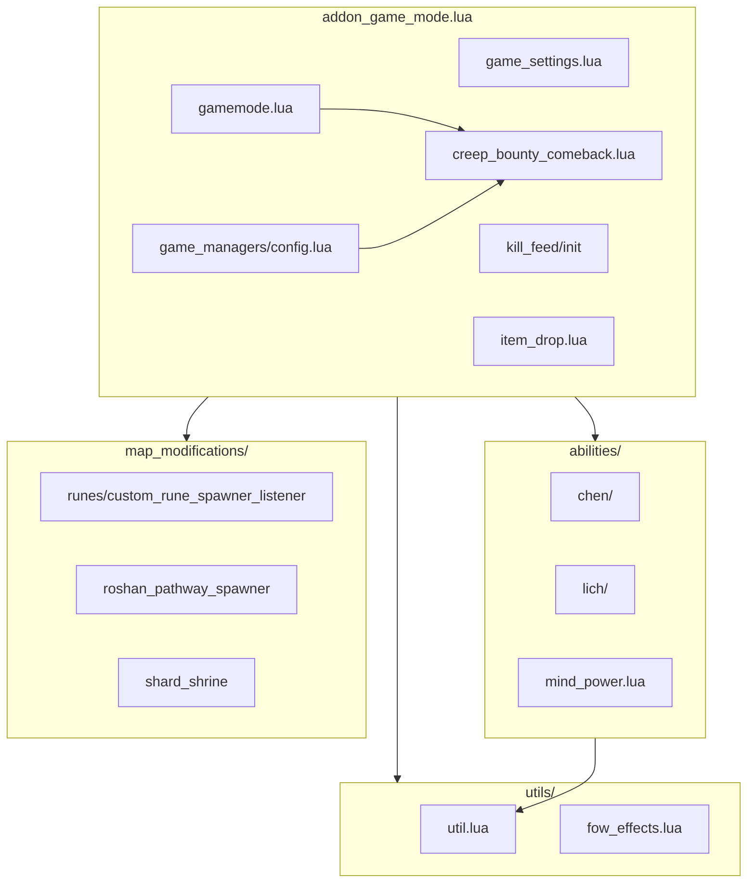
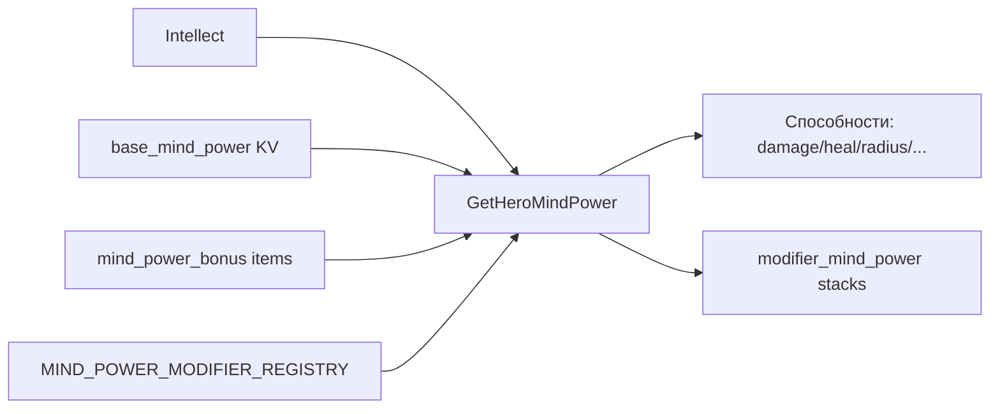
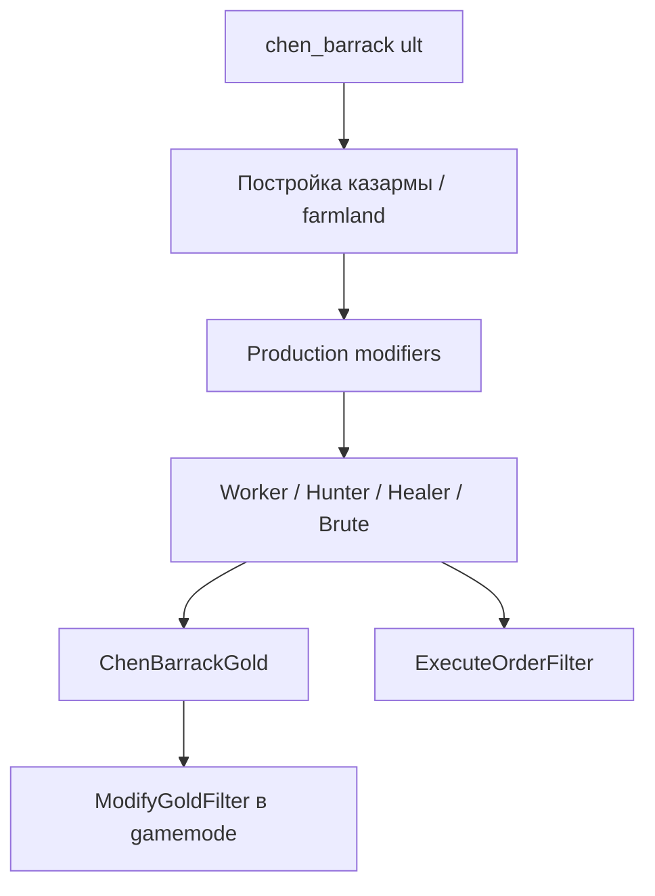

# Trinity — документация для агентов и разработчиков

> **Назначение:** первый файл, который нужно прочитать перед работой с репозиторием.  
> Описывает архитектуру, конвенции и все кастомные изменения относительно ванильной Dota 2.

---

## Содержание

1. [Обзор проекта](#обзор-проекта)
2. [Dev setup](#dev-setup)
3. [Структура репозитория](#структура-репозитория)
4. [Точки входа и загрузка](#точки-входа-и-загрузка)
5. [Игровой режим](#игровой-режим)
6. [Mind Power — ключевая механика](#mind-power--ключевая-механика)
7. [Глобальные системы](#глобальные-системы)
8. [Карта и PvE](#карта-и-pve)
9. [Кастомные герои](#кастомные-герои)
10. [Предметы](#предметы)
11. [UI и Panorama](#ui-и-panorama)
12. [Локализация](#локализация)
13. [Конвенции разработки](#конвенции-разработки)
14. [Диаграммы](#диаграммы)

---

## Обзор проекта

**Trinity** — кастомная игра (Dota 2 Custom Game / addon) с полностью переработанным пулом героев и собственными глобальными механиками.

| Параметр | Значение |
|----------|----------|
| Addon ID | `trinity` |
| Формат | 3v3 (Radiant vs Dire) |
| Карта | `dota3v3` (overview: `Game/resource/overviews/dota3v3.txt`) |
| Default map в addoninfo | `new2` |
| Max level | 30 |
| Max players | 8 (3+3 в `game_settings.lua`) |
| Базовый шаблон | Barebones (файл `game_settings.lua`) |
| Язык кода | Lua (server), Panorama JS/CSS (client) |

**Ключевые особенности:**

- Глобальная шкала **Mind Power** (масштабирует урон, хил, размер, радиусы и т.д.)
- Кастомные способности у **15 героев** (см. раздел [Кастомные герои](#кастомные-герои))
- Поэтапная **неуязвимость башен и тронов**
- **Comeback-бонусы** к золоту и опыту за крипов для отстающей команды
- **Chen** с системой казарм и экономикой
- Кастомные **руны**, **item drop**, **chat wheel**, **high five**
- Система **Kill Feed** (в разработке, см. [Глобальные системы](#глобальные-системы))

---

## Dev setup

### Структура symlink'ов

Репозиторий не лежит напрямую в папке Dota 2. Используются junction/symlink:

```
Trinity/
├── Game/    → steamapps/common/dota 2 beta/game/dota_addons/trinity
└── Content/ → steamapps/common/dota 2 beta/content/dota_addons/trinity
```

### Windows — создание окружения

```powershell
mkdir "PATH_TO_STEAM\steamapps\common\dota 2 beta\game\dota_addons\trinity"
mkdir "PATH_TO_STEAM\steamapps\common\dota 2 beta\content\dota_addons\trinity"

cd D:\Trinity
mklink /j Game "PATH_TO_STEAM\steamapps\common\dota 2 beta\game\dota_addons\trinity"
mklink /j Content "PATH_TO_STEAM\steamapps\common\dota 2 beta\content\dota_addons\trinity"
```

### Git

```powershell
git config core.symlinks true
```

### Запуск

1. Открыть Dota 2 → Arcade → Local Host
2. Выбрать addon **Trinity**
3. Карта: `dota3v3` (или `new2` — см. `Game/addoninfo.txt`)

### Полезные консольные команды

| Команда | Назначение |
|---------|------------|
| `create_roshan_spawner [x y z]` | Создать спавнер Roshan (cheat) |
| `spawn_roshan` | Спавн Roshan у героя игрока 0 |

---

## Структура репозитория

```
Trinity/
├── Game/                          # Скомпилированные ассеты + scripts (dota_addons/trinity)
│   ├── addoninfo.txt
│   ├── scripts/
│   │   ├── vscripts/              # Серверный Lua
│   │   ├── npc/                   # KV: герои, юниты, способности
│   │   ├── custom_net_tables.txt
│   │   └── custom.gameevents
│   ├── resource/                  # Локализация, spellicons
│   ├── particles/                 # Скомпилированные .vpcf_c
│   └── soundevents/
├── Content/                       # Исходники для Hammer / Workshop Tools
│   ├── maps/
│   ├── particles/                 # Исходные .vpcf
│   ├── panorama/                  # UI (layout, scripts, styles)
│   └── sounds/
└── docs/
    └── AGENTS.md                  # ← этот файл
```

### Разделение Game vs Content

| Game | Content |
|------|---------|
| Скомпилированные `.vpcf_c`, `.vsnd_c`, `.vtex_c` | Исходные `.vpcf`, `.mp3`, `.vmap` |
| `scripts/vscripts/*.lua` | `panorama/layout/`, `panorama/scripts/` |
| KV-файлы (`npc/`, `items/`) | Материалы, модели для компиляции |

---

## Точки входа и загрузка

### Цепочка загрузки



### Ключевые файлы

| Файл | Роль |
|------|------|
| `Game/scripts/vscripts/addon_game_mode.lua` | Главная точка входа: require модулей, Precache, Activate, action throttle |
| `Game/scripts/vscripts/game_settings.lua` | Barebones: правила игры, тайминги, события |
| `Game/scripts/vscripts/gamemode.lua` | Кастомная логика: башни, волны, chat wheel, gold filter |
| `Game/scripts/vscripts/game_managers/config.lua` | Инициализация менеджеров, выдача глобальных способностей |
| `Game/scripts/npc/npc_heroes_custom.txt` | Слоты способностей и статы героев |
| `Game/scripts/npc/npc_abilities_custom.txt` | `#base` → `_index.txt` → файлы по героям |

### Require-граф (основные модули)

`addon_game_mode.lua` подключает:

- `Timers`, `game_settings`, `utils/util`, `gamemode`, `item_drop`
- `game_managers/creep_bounty_comeback`, `game_managers/config`
- `kill_feed/init`
- Способности героев (Chen, Lich, Ogre, Tusk, DOOM, items, …)
- `ai_roshan_custom`, `map_modifications/roshan_pathway_spawner`

---

## Игровой режим

Настройки в `game_settings.lua`:

| Параметр | Значение |
|----------|----------|
| `PLAYER_COUNT_GOODGUYS` / `BADGUYS` | 3 / 3 |
| `STARTING_GOLD` | 600 |
| `HERO_START_LEVEL` | 1 |
| `Max_level` | 30 |
| `FREE_COURIER_ENABLED` | true |
| `HERO_RESPAWN_TIME` | 40 (scale 0.7 в gamemode → ~28 сек) |
| `RUNE_SPAWN_TIME` | 999999 (ванильные руны отключены) |
| `NEUTRAL_CREEP_SPAWN_TIME` | 0:00 |
| Gold tick | 2 gold / 1 sec |
| Buyback cooldown | 900 сек |
| Facets | Отключены у большинства героев (`"Facets" ""`) |

### Дополнительные правила (gamemode.lua)

- **x2 золото за килл героя** (`ModifyGoldFilter`)
- **Respawn time scale** 0.7
- **Time of day** 0.25 при старте
- Дополнительный спавн нейтралов на 1 и 3 секунде
- На спавне героя выдаются: `mind_power`, `empty_ability`, `high_five_custom`
- У Chen на спавне: `modifier_chen_holy_persuasion_mind_hp`

### Таланты

На уровнях 17, 19, 21–24 и ≥20 герой получает **дополнительное очко таланта** (компенсация за отсутствие стандартных уровней талантов).

---

## Mind Power — ключевая механика

**Mind Power (Сила Магии)** — глобальная числовая характеристика, заменяющая «голый интеллект» в формулах многих способностей.

### Расчёт

Функция: `GetHeroMindPower(hero)` в `Game/scripts/vscripts/utils/util.lua`

```
Mind Power = Intellect(false)
           + base_mind_power (из KV способности mind_power)
           + Σ mind_power_bonus (из предметов в слотах 0–8)
           + Σ бонусы модификаторов (через MIND_POWER_MODIFIER_REGISTRY)
```

### Отображение

- Способность `mind_power` — innate-пассив, стаки модификатора = текущее значение (cap 999)
- Выдаётся всем героям при спавне (`gamemode.lua`, `game_managers/config.lua`)

### Использование в способностях

Типичный паттерн в Lua:

```lua
local mind_power = GetHeroMindPower(caster) or 0
local total = base_value + mind_power * self:GetSpecialValueFor("mind_power_multiplier")
```

Герои/способности с `mind_power_multiplier` в KV: Lich, Juggernaut, Techies, Omniknight, Silencer, Weaver, Ogre Magi, DOOM, Tusk, Chen и др.

### Расширение через модификаторы

```lua
RegisterMindPowerModifier("modifier_name", function(modifier)
    return bonus_or_penalty
end)
```

Пример: `item_mage_slayer.lua` регистрирует дебафф `-mind_power_debuff`.

### Связанные утилиты

- `GetHeroBonusSpellAoE(hero)` — бонус к радиусу от предметов (`bonus_aoe`, `aoe_bonus`)
- `MIND_POWER_MODIFIER_REGISTRY` — реестр модификаторов для Mind Power

---

## Глобальные системы

### Comeback (creep bounty)

Файл: `game_managers/creep_bounty_comeback.lua`

Линейная шкала бонуса для **отстающей** команды:

| Тип | Max bonus | Порог для max |
|-----|-----------|---------------|
| Gold за крипов | 100% | разница net worth 5000 |
| XP за крипов | 100% | разница total XP 5000 |

Константы в `game_settings.lua`: `CREEP_BOUNTY_COMEBACK_*`, `CREEP_XP_COMEBACK_*`.

### XP Think

Файл: `game_managers/xp_think.lua`

Каждые **60 секунд** всем героям выдаётся пассивный опыт по таблице (10, 20, 33, …).

### Action Throttle

В `addon_game_mode.lua` — обёртки над `ApplyDamage` и `PerformAttack`: не более **3 действий за тик** на источник (оптимизация при массовом уроне).

### Система башен

Файл: `gamemode.lua`, модификатор `modifiers/modifier_tower_bonus_armor.lua`



Данные хранятся в `GameMode.towers` и `GameMode.ancients`.

### Line Boss / волны

`GameMode.wave_list` — 3 волны с наградами gold/exp и юнитами (`npc_line_creep_*`, `npc_line_boss_1`).  
`SpawnLineUnits` помечен как **TODO** — логика спавна не завершена.

### Item Drop

Файл: `item_drop.lua`

- Глобальные и per-unit дропы (`ItemDrop.item_drop`)
- Секретные предметы на named entities (`ItemDrop.secret_items` → `item_spawner_*`)

### Kill Feed

- Init: `require("kill_feed/init")` → `InitKillFeed()` в `addon_game_mode.lua`
- Net table: `kill_feed_debug`
- Custom events: см. `custom.gameevents`
- `KillfeedSystem.HERO_KILL_GOLD_MODE = "formula"`: базовая награда за убийство = `8 × уровень жертвы + 0,2% net worth жертвы`
- Базовая награда убийцы масштабируется относительно среднего net worth команды жертвы. При равенстве коэффициент равен `1`; по умолчанию он линейно ограничен диапазоном `0,5–1,5` и достигает границы при разнице в `50%` (`HERO_KILL_NET_WORTH_MAX_ADJUSTMENT_PCT`, `HERO_KILL_NET_WORTH_DIFFERENCE_FOR_MAX_PCT`).
- Первое валидное убийство вражеского героя в матче даёт убийце дополнительные `150` золота (`FIRST_HERO_KILL_BONUS_GOLD`)
- `KillfeedSystem.HERO_ASSIST_GOLD_MODE = "formula"`: убийце и каждому ассистенту = `15 + (50 + net worth жертвы × 0,05) / число участвовавших героев`; убийца также получает отдельное золото за килл
- **Статус:** модуль подключён в entry point; при отсутствии файлов `Game/scripts/vscripts/kill_feed/` игра упадёт при загрузке — проверять наличие перед работой

### Chat Wheel

- Panorama: `Content/panorama/layout/custom_game/chat_wheel/`
- Сервер: `GameMode:OnChatWheelSelect`, cooldown 10 сек, net table `cooldown_info`
- Custom event: `chat_wheel_send_sound`

### High Five

- Способность: `abilities/high_five_custom.lua` (выдаётся всем героям)
- Panorama: `Content/panorama/layout/custom_game/high_five/`

### Roshan

- `ai_roshan_custom.lua` — кастомный AI
- `map_modifications/roshan_pathway_spawner.lua` — pathway spawner
- `map_modifications/Roshan/` — юнит спавнера, AI pathway

### Shard Shrine

- `map_modifications/shard_shrine.lua`

---

## Карта и PvE

### Карта dota3v3

- Overview: `Game/resource/overviews/dota3v3.txt`
- Материалы: `Content/materials/overviews/dota3v3.*`
- Prefabs: custom shop и др. в `Content/maps/prefabs/`

### Кастомные руны

Файл: `map_modifications/runes/custom_rune_spawner_listener.lua`

| Время | Тип руны |
|-------|----------|
| 0:00 | Bounty |
| 2:00 | Water |
| до 4:59 | Water |
| 5:00+ | Random powerup (DD, Haste, Illusion, Invis, Regen, Arcane, Shield) |

Интервал спавна: 120 сек. Ванильный цикл рун отключён.

### Guardian / Leash

`GameMode:SpawnGuardianWithLeash` — спавн юнита с `modifier_leash_to_spawn`.

---

## Кастомные герои

Источник правды для слотов: `Game/scripts/npc/npc_heroes_custom.txt`  
KV способностей: `Game/scripts/npc/abilities/<hero>.txt`  
Lua: `Game/scripts/vscripts/abilities/<hero>/`

> **Примечание:** если слот способности **не переопределён** в `npc_heroes_custom.txt`, используется **ванильная** способность Dota 2 на этом слоте.

---

### Phantom Assassin

**Изменённые статы:** MS 309, Armor 4.7, Facets отключены.

| Слот | Способность | Статус |
|------|-------------|--------|
| Q, W | Stifling Dagger, Phantom Strike | Ванильные |
| E | `phantom_assassin_blur_custom` | **Кастом** — замена Blur |
| Shard | `phantom_assassin_phantom_cloud` | **Кастом** |
| R | `ability_coup_de_foudre` | **Кастом** — замена Coup de Grace |
| Таланты | `special_bonus_unique_custom_phantom_assassin_1..8` | **Кастом** |

**Lua:** `abilities/phantom_assassin/`

---

### Techies

**Изменённые статы:** Armor 4.7, Facets отключены. Полная замена набора.

| Слот | Способность |
|------|-------------|
| Q | `ability_fireworks` |
| W | `ability_techies_parry_blast` |
| E | `techies_suicide_custom` |
| R | `ability_chain_bomb` |
| — | `techies_sticky_bomb_bonus` |

**Lua:** `abilities/techies/`

---

### Juggernaut

**Изменённые статы:** MS 296, Armor 5.3.

| Слот | Способность | Статус |
|------|-------------|--------|
| Q | `juggernaut_blade_fury_lua` | **Кастом** |
| W | `juggernaut_bloodlust` | **Кастом** |
| E | `ability_thirsty_blade` | **Кастом** |
| R | `juggernaut_omni_slash` | Ванильное имя (проверить реализацию) |
| Ult | `juggernaut_swift_slash_lua` | **Кастом** |

**Lua:** `abilities/juggernaut/`

---

### Lich

**Изменённые статы:** MS 293, Armor 1.8. Почти полная замена набора.

| Слот | Способность |
|------|-------------|
| Q | `lich_frost_blast_lua` |
| W | `lich_frost_shield_lua` |
| E | `lich_spark_wraith` |
| Scepter | `ability_sinister_gaze` |
| R | `ability_ice_phylactery` |

**Lua:** `abilities/lich/`, `lich/frost_blast/`, `lich/frost_shield/`

---

### Tinker

**Изменённые статы:** Armor 4.8, Facets отключены. Частичная замена.

| Слот | Способность | Статус |
|------|-------------|--------|
| Q, W, R | Laser, March, Shrapnel (типично) | Ванильные |
| E | `tinker_heat_seeking_missile` | Переназначен слот |
| Ult | `tinker_rearm_custom` | **Кастом** — замена Rearm |

**Lua:** `abilities/tinker/tinker_rearm_custom`

---

### Ogre Magi

**Изменённые статы:** MS 276, Armor 6.3, Int 14 (+0.7/ур.).

| Слот | Способность |
|------|-------------|
| Q | `ogre_magi_fire_blast` — **кастом** (точка + AOE, bonk) |
| W | `ogre_magi_strength_boost` — **кастом**, масштаб от Mind Power |
| Scepter | `ogre_magi_aghanim_club` |
| Ult | `ogre_magi_reroll` |
| W (ван.) | Bloodlust — слот 3 ванильный, если не переопределён |

**Lua:** `abilities/ogre_magi/`

---

### Lycan

**Изменённые статы:** Armor 3.

| Слот | Способность | Статус |
|------|-------------|--------|
| Ult-слот (Ab1) | `lycan_summon_wolves_custom` | **Кастом** — волки на ult-слоте |
| Остальное | Shapeshift, Howl, Feral Impulse | Ванильные |

**Lua:** `abilities/lycan/lycan_summon_wolves_custom`

---

### Omniknight

**Изменённые статы:** MS 285, Armor 4.5.

| Слот | Способность |
|------|-------------|
| Q | `custom_purification` |
| W | `omniknight_repel_lua` |
| E | `omniknight_innate_oaa` — замена innate |
| Scepter | `omniknight_holy_grenade` |
| R | `holy_ground` |

**Lua:** `abilities/omniknight/`

---

### Doom

**Изменённые статы:** MS 275, Armor 3.5, Facets скрыты.

| Слот | Способность |
|------|-------------|
| Q | `doom_soul_devour` |
| W | `doom_scorched_earth_lua` |
| R | `doom_ultimate_aura` |

**Lua:** `abilities/DOOM/`

---

### Tusk

**Изменённые статы:** Armor 4.8.

| Слот | Способность | Статус |
|------|-------------|--------|
| Q | `tusk_ice` | **Кастом** |
| W | `tusk_mp_snowball` | **Кастом** |
| E | `tusk_tag_team` | Ванильное имя |
| R | `tusk_channeled_snowball` | **Кастом** |

**Lua:** `abilities/Tusk/`

---

### Weaver

**Изменённые статы:** Armor 3.8.

| Слот | Способность | Статус |
|------|-------------|--------|
| W | `weaver_cucaracha` | **Кастом** — замена Shukuchi |
| Остальное | The Swarm, Geminate, Time Lapse | Ванильные |

**Lua:** `abilities/Weaver/Cucaracha.lua`

---

### Silencer

**Изменённые статы:** Armor 3.7.

| Слот | Способность |
|------|-------------|
| Q | `silencer_arcane_curse_custom` |
| W | Glaives of Wisdom | Ванильная |
| E | `silencer_last_word_custom` |
| Scepter | `silencer_global_silence` — стандартная Global Silence |
| R | `silent_square` — **кастом ult** |

**Lua:** `abilities/silencer/`

---

### Chen

**Изменённые статы:** Armor 1.5. **Полный реворк** + RTS-подсистема казарм.

| Слот | Способность |
|------|-------------|
| Q | `chen_martyr_mark` |
| W | `chen_holy_persuasion_custom` — приручение с Mind Power HP |
| E | `chen_whip` |
| Shard | `chen_ultimate_aura` |
| R | `chen_barrack` — **ульт: система казарм** |

**Подсистема казарм** (`abilities/chen/chen_barrack.lua`, ~2400 строк):

- Юниты: worker, hunter, healer, brute
- Farmland, производство, сбор ресурсов
- `chen_sub_barrack`, `chen_worker_build`
- После постройки ульт переключается между `chen_barrack_takeoff` и `chen_barrack_land`: барак летает со скоростью 200, при посадке запускается фиксированный КД 120 секунд; производство и пашни в полёте приостановлены.
- Экономика: `ChenBarrackGold` — фильтр золота, carrier/shared_carrier режимы
- Order filter: `ChenBarrackWorkerHandleOrder`
- Inventory hooks в `gamemode.lua`

**Lua:** `abilities/chen/`, `modifiers/chen/`

---

### Furion

**Изменённые статы:** MS 310, Armor 2.3.

| Слот | Способность |
|------|-------------|
| Q | `furion_sprout` |
| W | `furion_teleportation` — **кастом** (проклятие деревьев) |
| E | `furion_spirit_of_forest` — пассив от деревьев |
| Scepter | `furion_nature_essence` |
| R | `furion_nature_security` — детекция + наказание |

**Lua:** `abilities/furion/`

---

### Общие способности (все герои)

| Способность | Назначение |
|-------------|------------|
| `mind_power` | Innate, отображает Mind Power |
| `empty_ability` | Innate-заглушка |
| `high_five_custom` | Кастомный high five |

KV: `Game/scripts/npc/abilities/shared.txt`

---

## Предметы

| Предмет | Файл | Особенность |
|---------|------|-------------|
| `item_kaya_mind_power` | `items/item_kaya_mind_power.lua` | Бонус Mind Power |
| `item_mage_slayer` | `items/item_mage_slayer.lua` | Дебафф Mind Power через DamageFilter |

KV предметов: `Game/scripts/npc/items/` (если есть) + lua-реализация.

---

## UI и Panorama

Исходники: `Content/panorama/`

| Компонент | Путь |
|-----------|------|
| Manifest | `layout/custom_game/custom_ui_manifest.xml` |
| Chat Wheel | `layout/custom_game/chat_wheel/` |
| High Five | `layout/custom_game/high_five/` |
| Game Events panel | `layout/custom_game/ui/game_events/` |
| Loading Screen | `layout/custom_game/custom_loading_screen.xml` |
| Init script | `scripts/custom_game/init.js` |

Custom Net Tables (`custom_net_tables.txt`):

- `cooldown_info` — chat wheel cooldown
- `kill_feed_debug` — отладка kill feed

Custom Game Events (`custom.gameevents`): `draw_game_event`, `chat_wheel_send_sound`, события kill feed.

---

## Локализация

| Файл | Язык |
|------|------|
| `Game/resource/addon_russian.txt` | RU |
| `Game/resource/addon_english.txt` | EN |

**Ключи способностей:** `DOTA_Tooltip_ability_<ability_name>`, `_Description`, `_Note`, `_Lore`.

### Стиль описаний

Перед написанием локализации способности — **смотреть примеры Лича** (`addon_russian.txt`, способности `lich_*`):

- Простые абзацы
- Разбиение на блоки (описание / детали / scepter-shard)
- Без перегруженного текста

---

## Конвенции разработки

### Precache

> **Правило проекта:** прекеш **только в Lua** (`Precache()` в `addon_game_mode.lua` или `PrecacheResource` в способности).  
> **Не добавлять** блоки `"precache"` в KV-файлы новых способностей.

*(В старых KV блоки precache могут присутствовать — при рефакторинге переносить в Lua.)*

### Иконки способностей

> **Правило:** иконка задаётся **только в KV** через `"AbilityTextureName"`.  
> Файлы иконок: `Game/resource/flash3/images/spellicons/`

### Lua-способности

- `BaseClass` = `ability_lua`
- `ScriptFile` — путь от `scripts/vscripts/` без расширения
- Модификаторы: `LinkLuaModifier` в том же файле или require
- Mind Power: использовать `GetHeroMindPower(caster)`, не сырой `GetIntellect`

### KV-структура способностей

```
Game/scripts/npc/npc_abilities_custom.txt
  └── #base "_index.txt"
        ├── shared.txt      (mind_power, empty_ability, high_five)
        ├── units.txt
        └── <hero>.txt      (по одному файлу на героя)
```

### Новый герой / способность — чеклист

1. KV в `Game/scripts/npc/abilities/<hero>.txt`
2. Добавить `#base` в `_index.txt` (если новый файл)
3. Слоты в `npc_heroes_custom.txt`
4. Lua в `Game/scripts/vscripts/abilities/<hero>/`
5. `require` в `addon_game_mode.lua`
6. Precache партиклов/звуков в Lua
7. Иконка в KV + файл в `spellicons/`
8. Локализация RU (+ EN при необходимости)
9. Таланты: `special_bonus_unique_custom_<hero>_1..8`

### Неизвестное API

При использовании незнакомого API — сверяться с **Context7** (MCP documentation).

---

## Диаграммы

### Архитектура модулей



### Mind Power — поток данных



### Chen Barracks — упрощённо



---

## Быстрые ссылки на файлы

| Задача | Файл |
|--------|------|
| Изменить правила 3v3 | `game_settings.lua` |
| Башни / волны | `gamemode.lua` |
| Mind Power формула | `utils/util.lua` |
| Выдача способностей всем | `game_managers/config.lua` |
| Слоты героев | `npc/npc_heroes_custom.txt` |
| KV способности | `npc/abilities/<hero>.txt` |
| Точка require | `addon_game_mode.lua` |
| Panorama UI | `Content/panorama/layout/custom_game/` |
| Локализация RU | `Game/resource/addon_russian.txt` |

---

*Последнее обновление документа: июнь 2026. При добавлении героев, систем или изменении конвенций — обновлять этот файл.*
