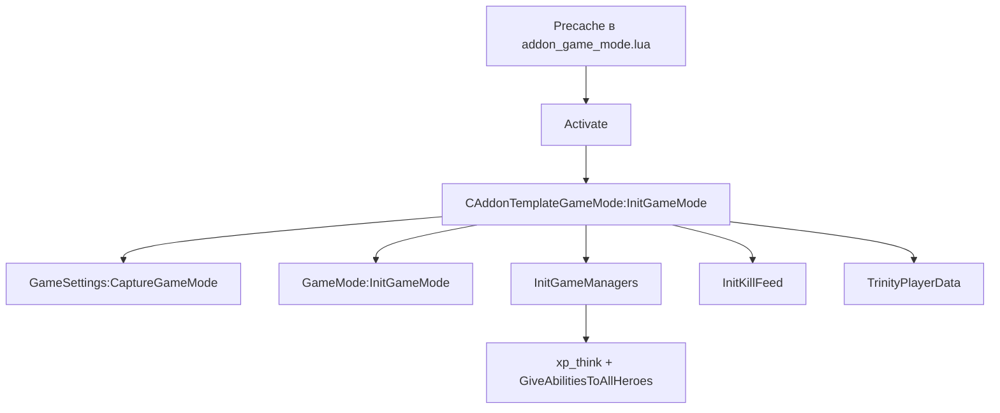
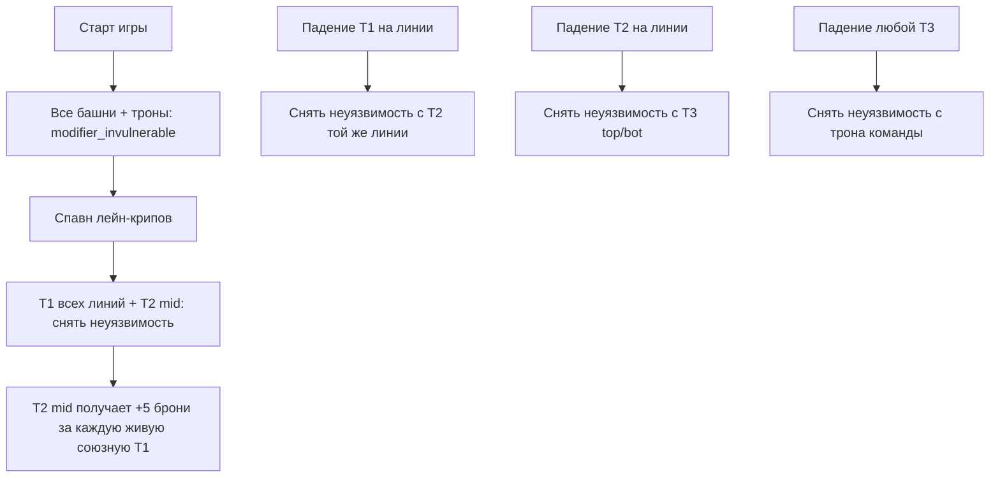
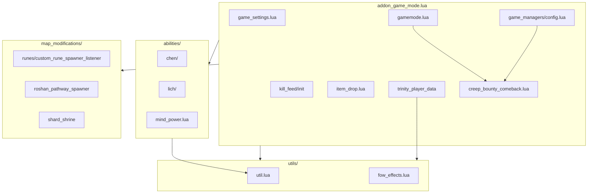
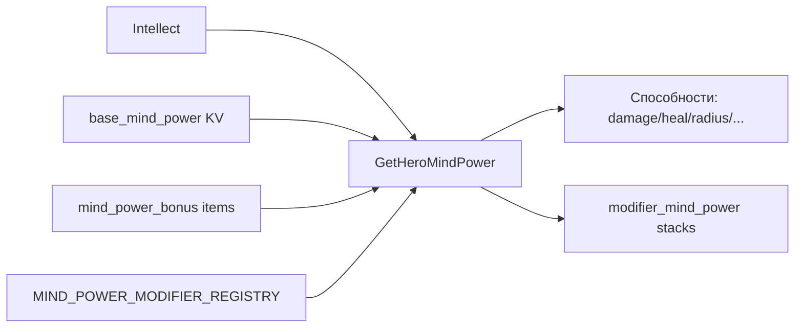
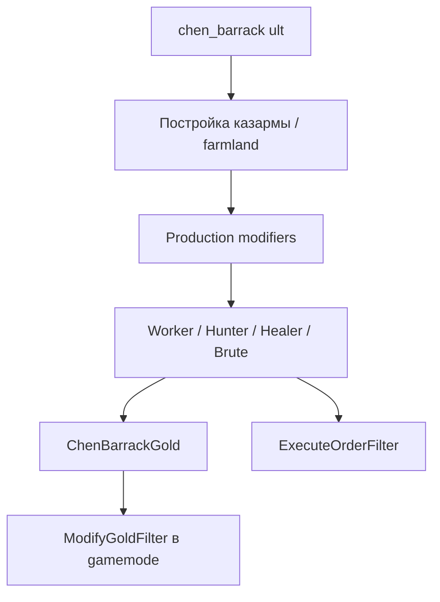

# Trinity — документация для агентов и разработчиков

## Стиль ответов агента

Представляй слова в диалогах как ограниченный бюджет: экономь их, сохраняя суть текста.

> **Назначение:** первый файл, который нужно прочитать перед работой с репозиторием.  
> Описывает архитектуру, конвенции и все кастомные изменения относительно ванильной Dota 2.

---

## Содержание

1. [Обзор проекта](#обзор-проекта)
2. [Dev setup](#dev-setup)
3. [Структура репозитория](#структура-репозитория)
4. [Точки входа и загрузка](#точки-входа-и-загрузка)
5. [Игровой режим](#игровой-режим)
6. [Mind Power — ключевая механика](#mind-power--ключевая-механика)
7. [Глобальные системы](#глобальные-системы)
8. [Карта и PvE](#карта-и-pve)
9. [Кастомные герои](#кастомные-герои)
10. [Предметы](#предметы)
11. [UI и Panorama](#ui-и-panorama)
12. [Локализация](#локализация)
13. [Конвенции разработки](#конвенции-разработки)
14. [Бэкенд профилей](#бэкенд-профилей)
15. [Диаграммы](#диаграммы)

---

## Обзор проекта

**Trinity** — кастомная игра (Dota 2 Custom Game / addon) с полностью переработанным пулом героев и собственными глобальными механиками.

| Параметр | Значение |
|----------|----------|
| Addon ID | `trinity` |
| Формат | 3v3 (Radiant vs Dire) |
| Карта | `dota3v3` (overview: `Game/resource/overviews/dota3v3.txt`) |
| Default map в addoninfo | `new2` |
| Max level | 30 |
| Max players | 8 (3+3 в `game_settings.lua`) |
| Базовый шаблон | Barebones (файл `game_settings.lua`) |
| Язык кода | Lua (server), Panorama JS/CSS (client) |

**Ключевые особенности:**

- Глобальная шкала **Mind Power** (масштабирует урон, хил, размер, радиусы и т.д.)
- Кастомные способности у **16 героев** (см. раздел [Кастомные герои](#кастомные-герои))
- Поэтапная **неуязвимость башен и тронов**
- **Comeback-бонусы** к золоту и опыту за крипов для отстающей команды
- **Chen** с системой казарм и экономикой
- Кастомные **руны**, **item drop**, **chat wheel**, **high five**
- Система **Kill Feed** (в разработке, см. [Глобальные системы](#глобальные-системы))

---

## Dev setup

### Структура symlink'ов

Репозиторий не лежит напрямую в папке Dota 2. Используются junction/symlink:

```
Trinity/
├── Game/    → steamapps/common/dota 2 beta/game/dota_addons/trinity
└── Content/ → steamapps/common/dota 2 beta/content/dota_addons/trinity
```

### Windows — создание окружения

```powershell
mkdir "PATH_TO_STEAM\steamapps\common\dota 2 beta\game\dota_addons\trinity"
mkdir "PATH_TO_STEAM\steamapps\common\dota 2 beta\content\dota_addons\trinity"

cd D:\Trinity
mklink /j Game "PATH_TO_STEAM\steamapps\common\dota 2 beta\game\dota_addons\trinity"
mklink /j Content "PATH_TO_STEAM\steamapps\common\dota 2 beta\content\dota_addons\trinity"
```

### Git

```powershell
git config core.symlinks true
```

### Запуск

1. Открыть Dota 2 → Arcade → Local Host
2. Выбрать addon **Trinity**
3. Карта: `dota3v3` (или `new2` — см. `Game/addoninfo.txt`)

### Полезные консольные команды

| Команда | Назначение |
|---------|------------|
| `create_roshan_spawner [x y z]` | Создать pathway-спавнер Мортимера (legacy-имя команды, cheat) |
| `spawn_mortimer_boss [x y z]` | Создать Мортимера первого уровня без движения по маршруту (cheat) |
| `mortimer_attack_debug 0\|1` | Отключить/включить вывод диагностики приказов атаки по Мортимеру |
| `mortimer_kisses_debug 0\|1` | Отключить/включить вывод диагностики целей посмертных Kisses |
| `draft_spawn_debug 0\|1` | Лог дня/ночи разминки в консоль (по умолчанию включён) |
| `trinity_backend_debug 0\|1` | Лог HTTP к PHP API профилей |
| `trinity_backend_ping` | Проверить `GET /v1/health` |
| `spawn_roshan` | Спавн Roshan у героя игрока 0 |

---

## Структура репозитория

```
Trinity/
├── Game/                          # Скомпилированные ассеты + scripts (dota_addons/trinity)
│   ├── addoninfo.txt
│   ├── scripts/
│   │   ├── vscripts/              # Серверный Lua
│   │   ├── npc/                   # KV: герои, юниты, способности
│   │   ├── custom_net_tables.txt
│   │   └── custom.gameevents
│   ├── resource/                  # Локализация, spellicons
│   ├── particles/                 # Скомпилированные .vpcf_c
│   └── soundevents/
├── Content/                       # Исходники для Hammer / Workshop Tools
│   ├── maps/
│   ├── particles/                 # Исходные .vpcf
│   ├── panorama/                  # UI (layout, scripts, styles)
│   └── sounds/
├── server/                        # PHP API профилей (не входит в addon VPK)
│   ├── public/                    # document root: /v1/health, /v1/players
│   ├── src/
│   ├── schema.sql
│   └── config.example.php
└── docs/
    └── AGENTS.md                  # ← этот файл
```

### Разделение Game vs Content

| Game | Content |
|------|---------|
| Скомпилированные `.vpcf_c`, `.vsnd_c`, `.vtex_c` | Исходные `.vpcf`, `.mp3`, `.vmap` |
| `scripts/vscripts/*.lua` | `panorama/layout/`, `panorama/scripts/` |
| KV-файлы (`npc/`, `items/`) | Материалы, модели для компиляции |

---

## Точки входа и загрузка

### Цепочка загрузки


```mermaid
flowchart TD
    A[Precache в addon_game_mode.lua] --> B[Activate]
    B --> C[CAddonTemplateGameMode:InitGameMode]
    C --> D[GameSettings:CaptureGameMode]
    C --> E[GameMode:InitGameMode]
    C --> F[InitGameManagers]
    C --> G[InitKillFeed]
    C --> H[TrinityPlayerData]
    F --> I[xp_think + GiveAbilitiesToAllHeroes]
```

### Ключевые файлы

| Файл | Роль |
|------|------|
| `Game/scripts/vscripts/addon_game_mode.lua` | Главная точка входа: require модулей, Precache, Activate, action throttle |
| `Game/scripts/vscripts/game_settings.lua` | Barebones: правила игры, тайминги, события |
| `Game/scripts/vscripts/gamemode.lua` | Кастомная логика: башни, волны, chat wheel, gold filter |
| `Game/scripts/vscripts/game_managers/config.lua` | Инициализация менеджеров, выдача глобальных способностей |
| `Game/scripts/npc/npc_heroes_custom.txt` | Слоты способностей и статы героев |
| `Game/scripts/npc/npc_abilities_custom.txt` | `#base` → `_index.txt` → файлы по героям |

### Require-граф (основные модули)

`addon_game_mode.lua` подключает:

- `Timers`, `draft_spawn`, `game_settings`, `utils/util`, `gamemode`, `item_drop`
- `game_managers/creep_bounty_comeback`, `game_managers/config`, `game_managers/trinity_player_data`
- `kill_feed/init`
- Способности героев (Chen, Lich, Ogre, Tusk, DOOM, items, …)
- `ai_roshan_custom`, `map_modifications/roshan_pathway_spawner`

---

## Игровой режим

Настройки в `game_settings.lua`:

| Параметр | Значение |
|----------|----------|
| `PLAYER_COUNT_GOODGUYS` / `BADGUYS` | 3 / 3 |
| Alternate hero grids | Отключены (`ENABLE_ALTERNATE_HERO_GRIDS = false`) |
| `STARTING_GOLD` | 600 |
| `HERO_START_LEVEL` | 1 |
| `Max_level` | 30 |
| `FREE_COURIER_ENABLED` | true |
| `HERO_RESPAWN_TIME` | 40 (scale 0.7 в gamemode → ~28 сек) |
| `HERO_SELECTION_TIME` | 60 сек; непикнувшие получают random в **-0:30** |
| Strategy / Showcase / Pre-game | 0 / 0 / 30 сек после разминки |
| `WARMUP_POST_PREGAME_TIME` | 30 сек: часы **-0:30 → 0:00** |
| `RUNE_SPAWN_TIME` | 999999 (ванильные руны отключены) |
| `NEUTRAL_CREEP_SPAWN_TIME` | 0:00 |
| Gold tick | 2 gold / 1 sec |
| Buyback cooldown | 900 сек |
| Facets | Отключены у большинства героев (`"Facets" ""`) |

### Вход в матч / драфт

После лока героя игрок сразу попадает на карту. Нативный экран пика скрывается только у него; остальные продолжают выбирать. Strategy и showcase отключены.

Часы с начала драфта идут с **-1:30**. Через **60 секунд** (**-0:30**) разминка кончается: непикнувшие получают random, пик закрыт, вайп, начинают тикать золото и опыт, First Blood уже можно получить. Ночь держится до **0:00**. Лайн-крипы появляются в **0:00**, тогда же ночь сменяется на день; башни становятся уязвимыми после выхода крипов.

До **-0:30** действует временная песочница: движение, **9999 золота**, бесплатная покупка/продажа в магазине без траты этого золота, мгновенный респаун, чат `-level N` / `-lvlup`, виджет над киллфидом (заголовок «Разминка», таймер до конца, кнопки `+1 уровень`, `Max` и Refresh: полное HP/мана и сброс КД способностей и предметов). Тик золота/опыта (`empty_ability` и gold tick) на разминке выключен. Убийства героев на разминке не дают золото, опыт, ассисты и First Blood; первое убийство после **-0:30** всё ещё считается FB. В конце разминки снимаются 9999 золота, купленные предметы, полученные уровни, прокачанные способности и счётчики K/D/A; герой снова 1 уровня с невыученными способностями (одно свободное очко при `HERO_START_LEVEL = 1`), Town Portal без перезарядки и `STARTING_GOLD`.

При входе на карту только этому игроку уходит `trinity_warmup_started` и заголовок `draw_game_event`. Когда разминка кончается, всем уходит `trinity_warmup_ended`.

В точке Hammer `trinity_warmup_dummy` на время разминки стоит `npc_dota_hero_target_dummy`. Если его убить, он появляется снова в этой же точке; в **-0:30** удаляется.

На разминке герои появляются в Hammer-точках `trinity_warmup_spawn` / `trinity_warmup_spawn_good` / `trinity_warmup_spawn_bad`. Первый спавн ловится в `npc_spawned`: герой скрывается `AddNoDraw` и в том же кадре ставится на точку разминки, чтобы не мелькать на фонтане. Камера ставится сразу на эту точку (`SetCameraTargetPosition` без lerp и без `SetCameraTarget`, чтобы не ехать со спавна фонтана). Оверлей пика скрывается после snap. Триггер `trinity_warmup_zone` держит их на площадке: если точка спавна внутри триггера, возврат срабатывает при выходе; если снаружи — при касании. Мгновенный респаун тоже в эти точки. В **-0:30** зона выключается, вайп (`ReplaceHeroWith`) ставит героев на точки респавна у фонтана (`info_player_start_dota` / `info_player_start_goodguys|badguys`, иначе `ent_dota_fountain`). Ночь (`SetTimeOfDay(0.75)`, цикл выключен) держится до **0:00** даже если движок уже в `GAME_IN_PROGRESS`.

`DraftSpawn:LockNightUntilLanePhase` вызывается из тика каждые 0.1 секунды, поэтому она обязана быть идемпотентной: `SetTimeOfDay` дёргается только при реальном расхождении времени суток, а `SetDaynightCycleDisabled(true)` — один раз, по флагу `_daynightCycleLocked` (сбрасывается в `EnableLanePhaseSystems`). Безусловный вызов `SetTimeOfDay` в тике заставляет клиент каждый раз заново запускать ночной эмбиент: за разминку накапливается около девятисот наложенных копий лупа, они звучат как ровный гул и обрываются все вместе через 4–5 секунд после включения дня.

Имена должны быть в **скомпилированной** карте `Game/maps/new2.vpk`. Источник `Content/maps/new2.vmap` без Build/Compile в Hammer в матч не попадает. Запускать нужно карту `new2`, не `dota3v3`.

Lua: `Game/scripts/vscripts/game_managers/draft_spawn.lua`  
Panorama: `Content/panorama/scripts/custom_game/draft_spawn.js`, `Content/panorama/layout/custom_game/warmup_widget/`  
Дебаг: `draft_spawn_debug 1` (включён по умолчанию) пишет в консоль день/ночь (`[DraftSpawn] daynight`) и спавн дамика (`[DraftSpawn] dummy`).

### Дополнительные правила (gamemode.lua)

- **x2 золото за килл героя** (`ModifyGoldFilter`)
- **Respawn time scale** 0.7
- **Time of day** 0.25 при старте
- Дополнительный спавн нейтралов на 1 и 3 секунде
- На спавне героя выдаются: `mind_power`, `empty_ability`, `high_five_custom`
- У Chen на спавне: `modifier_chen_holy_persuasion_mind_hp`

### Таланты

На уровнях 17, 19, 21–24 и ≥20 герой получает **дополнительное очко таланта** (компенсация за отсутствие стандартных уровней талантов).

---

## Mind Power — ключевая механика

**Mind Power (Сила Магии)** — глобальная числовая характеристика, заменяющая «голый интеллект» в формулах многих способностей.

### Расчёт

Функция: `GetHeroMindPower(hero)` в `Game/scripts/vscripts/utils/util.lua`

```
Mind Power = Intellect(false)
           + base_mind_power (из KV способности mind_power)
           + Σ mind_power_bonus (из предметов в слотах 0–8)
           + Σ бонусы модификаторов (через MIND_POWER_MODIFIER_REGISTRY)
```

### Отображение

- Способность `mind_power` — innate-пассив, стаки модификатора = текущее значение (cap 999)
- Выдаётся всем героям при спавне (`gamemode.lua`, `game_managers/config.lua`)
- Полное значение героя публикуется по `entindex` в net table `mind_power`; нативный тултип получает то же значение через custom transmitter модификатора.

### Динамические значения в тултипах

Способности, перечисленные в `MIND_POWER_RULES` файла `Game/scripts/vscripts/game_managers/custom_ability_tooltips.lua`, получают динамические значения прямо в нативном блоке параметров Dota. Правило явно связывает параметр с его множителем:

```lua
pudge_meat_hook_trinity = {
    damage = "mind_power_multiplier",
},
```

Для такой связи значение считается как `базовое специальное значение способности + Mind Power × multiplier`. Положительный множитель увеличивает значение, отрицательный уменьшает; итог ограничивается нулём. `modifier_mind_power` передаёт полное значение через custom transmitter и на клиенте реализует `MODIFIER_PROPERTY_OVERRIDE_ABILITY_SPECIAL` / `MODIFIER_PROPERTY_OVERRIDE_ABILITY_SPECIAL_VALUE`. Поэтому нативный тултип обновляется самим движком без Panorama-копии. На сервере override отключён: игровые Lua-формулы остаются источником истины и не получают повторное масштабирование. Способность юнита `chen_barrack_hunter_overload` использует отдельный скрытый intrinsic-модификатор, который передаёт Силу магии владельца.

Каждая действующая Lua-формула, которая складывает базовый параметр со значением от Mind Power, должна иметь явную связь в `MIND_POWER_RULES`. Если бонус не соответствует существующему базовому параметру (например, независимый бонус урона и усиление магического урона у `ember_flame_guard_passive`), в `AbilityValues` добавляется отдельный отображаемый результирующий параметр с базовым значением `0`; множители и правила по-прежнему хранятся отдельно. Игровые формулы всегда получают полное значение через `GetHeroMindPower`, а не через `modifier_mind_power:GetStackCount()`, потому что визуальный стек ограничен 999.

- Реестр и общий расчёт: `Game/scripts/vscripts/game_managers/custom_ability_tooltips.lua`
- Клиентский override героя: `Game/scripts/vscripts/abilities/mind_power.lua`
- Override юнита Chen: `Game/scripts/vscripts/abilities/chen/barrack/units/chen_barrack_hunter_focus.lua`
- Net table `mind_power` сохранена для публикации полного значения по `entindex`; нативный тултип получает значение через custom transmitter модификатора.

### Использование в способностях

Типичный паттерн в Lua:

```lua
local mind_power = GetHeroMindPower(caster) or 0
local total = base_value + mind_power * self:GetSpecialValueFor("mind_power_multiplier")
```

Герои/способности с действующим масштабированием от Mind Power в KV: Lich, Juggernaut, Techies, Omniknight, Silencer, Ogre Magi, DOOM, Chen, Pudge, Ember Spirit, Lion, Shadow Fiend и Tinker.

### Расширение через модификаторы

```lua
RegisterMindPowerModifier("modifier_name", function(modifier)
    return bonus_or_penalty
end)
```

Пример: `item_mage_slayer.lua` регистрирует дебафф `-mind_power_debuff`.

### Связанные утилиты

- `GetHeroBonusSpellAoE(hero)` — бонус к радиусу от предметов (`bonus_aoe`, `aoe_bonus`)
- `MIND_POWER_MODIFIER_REGISTRY` — реестр модификаторов для Mind Power

---

## Глобальные системы

### Comeback (creep bounty)

Файл: `game_managers/creep_bounty_comeback.lua`

Линейная шкала бонуса для **отстающей** команды:

| Тип | Max bonus | Порог для max |
|-----|-----------|---------------|
| Gold за крипов | 100% | разница net worth 5000 |
| XP за крипов | 100% | разница total XP 5000 |

Константы в `game_settings.lua`: `CREEP_BOUNTY_COMEBACK_*`, `CREEP_XP_COMEBACK_*`.

### XP Think

Файл: `game_managers/xp_think.lua`

Каждые **60 секунд** всем героям выдаётся пассивный опыт по таблице (10, 20, 33, …).

### Action Throttle

В `addon_game_mode.lua` — обёртки над `ApplyDamage` и `PerformAttack`: не более **3 действий за тик** на источник (оптимизация при массовом уроне).

### Система башен

Файл: `gamemode.lua`, модификатор `modifiers/modifier_tower_bonus_armor.lua`


```mermaid
flowchart TD
    Start[Старт игры] --> Inv[Все башни + троны: modifier_invulnerable]
    Inv --> Creeps[Спавн лейн-крипов]
    Creeps --> T1[T1 всех линий + T2 mid: снять неуязвимость]
    T1 --> T2Mid[T2 mid получает +5 брони за каждую живую союзную T1]
    T1Kill[Падение T1 на линии] --> T2[Снять неуязвимость с T2 той же линии]
    T2Kill[Падение T2 на линии] --> T3[Снять неуязвимость с T3 top/bot]
    T3Kill[Падение любой T3] --> Ancient[Снять неуязвимость с трона команды]
```

Данные хранятся в `GameMode.towers` и `GameMode.ancients`.

### Line Boss / волны

`GameMode.wave_list` — 3 волны с наградами gold/exp и юнитами (`npc_line_creep_*`, `npc_line_boss_1`).  
`SpawnLineUnits` помечен как **TODO** — логика спавна не завершена.

### Item Drop

Файл: `item_drop.lua`

- Глобальные и per-unit дропы (`ItemDrop.item_drop`)
- Секретные предметы на named entities (`ItemDrop.secret_items` → `item_spawner_*`)

### Kill Feed

- Init: `require("kill_feed/init")` → `InitKillFeed()` в `addon_game_mode.lua`
- Net table: `kill_feed_debug`
- Custom events: см. `custom.gameevents`
- `KillfeedSystem.HERO_KILL_GOLD_MODE = "formula"`: базовая награда за убийство = `8 × уровень жертвы + 2% net worth жертвы`
- Базовая награда убийцы масштабируется относительно среднего net worth команды жертвы. При равенстве коэффициент равен `1`; по умолчанию он линейно ограничен диапазоном `0,5–1,5` и достигает границы при разнице в `50%` (`HERO_KILL_NET_WORTH_MAX_ADJUSTMENT_PCT`, `HERO_KILL_NET_WORTH_DIFFERENCE_FOR_MAX_PCT`).
- Базовая награда за убийство получает командный rubberband-множитель по разнице суммарного net worth: линейно от `×0` при преимуществе в `5000` через `×1` при равенстве до `×2` при отставании в `5000` (`CREEP_BOUNTY_COMEBACK_MAX_BONUS_PCT`, `CREEP_BOUNTY_COMEBACK_NW_FOR_MAX`). Множитель не применяется к First Blood и золоту за ассисты.
- Первое валидное убийство вражеского героя в матче даёт убийце дополнительные `150` золота (`FIRST_HERO_KILL_BONUS_GOLD`)
- `KillfeedSystem.HERO_ASSIST_GOLD_MODE = "formula"`: убийце и каждому ассистенту = `15 + (50 + net worth жертвы × 0,05) / число участвовавших героев`; убийца также получает отдельное золото за килл
- Если героя убивает вражеская башня или посмертные Kisses Мортимера, формульная награда за убийство (включая First Blood, если применимо) равномерно распределяется между всеми игроками противоположной команды; остаток по одному золоту выдаётся первым игрокам команды.
- **Статус:** модуль подключён в entry point; при отсутствии файлов `Game/scripts/vscripts/kill_feed/` игра упадёт при загрузке — проверять наличие перед работой

### Chat Wheel

- Panorama: `Content/panorama/layout/custom_game/chat_wheel/`
- Редактор слотов на разминке: `Content/panorama/layout/custom_game/sticker_editor/`
- Редактор открывается кнопкой «Стикеры» над виджетом разминки и работает только пока разминка активна. Кнопка живёт в `warmup_widget` и вызывает функцию `GameUI.CustomUIConfig().TrinityOpenStickerEditor`, которую регистрирует редактор. Флаг разминки берётся из общего `CustomUIConfig().trinityWarmupActive`
- Окно модальное: затемнение на весь HUD, слева колесо из 8 слотов по радиусу вокруг нативной графики центра (`s2r://panorama/images/chat_wheel/`), справа список стикеров с чекбоксом «Скрыть недоступные». Закрытие — крестик, клик по затемнению, `Esc`
- Стикер назначается двумя способами: клик по стикеру и затем по слоту, либо перетаскивание (`SetDraggable` + `DragStart` / `DragEnter` / `DragDrop` / `DragEnd`). Перетаскивание между слотами меняет их содержимое местами; стикер из списка, уже стоящий на колесе, обменивается со слотом-целью. Слот освобождается правым кликом или перетаскиванием стикера за пределы колеса
- Изменения применяются в `DragEnd`, а не в `DragDrop`: перерисовка внутри `DragDrop` удаляет панель-источник до конца перетаскивания
- Видео-превью в правом списке проигрывается только под курсором, в слотах колеса — постоянно
- Слоты сохраняются существующим событием `trinity_sticker_save_wheel`; до подтверждения из net table клиент рисует локальную копию слотов
- Сервер: `GameMode:OnChatWheelSelect` принимает только стикер из сохранённого колеса игрока; cooldown `GameMode.CHAT_WHEEL_COOLDOWN` = 20 секунд, net table `cooldown_info`
- Инвентарь и колесо: PHP + net table `trinity_stickers`; клиент HTTP не вызывает
- Новый аккаунт: пустое колесо, `lootbox_pending = true`. Первая разминка — один лутбокс с равным шансом среди 8 стикеров. Дубликат (если появится позже) не добавляет копию
- 8 слотов, пустые можно; состав правится на разминке и пишется в `player_wheel`
- Custom event: `chat_wheel_send_sound`
- Событие `chat_wheel_send_sound` поддерживает два варианта `.webm`-стикера: над героем-отправителем или нативно оформленной строкой стандартного чата со значком героя, цветным ником, chat-wheel icon и видео.
- На каждом клиенте стикер выбирает только одно место показа: над героем, если тот находится в видимой области экрана в момент отправки, иначе — в чате.
- Для каждого стикера `CHAT_STICKER_SOUNDS` в `chat_wheel.js` задаёт существующее однократное sound event Dota; звук запускается клиентом один раз независимо от места показа стикера.
- Стикер `Choso` («Изи») использует кастомный event `Wheel.Choso` и ресурс `Content/sounds/wheel/choso.mp3`.
- Видео находятся в `Game/panorama/videos/custom_game/` и загружаются через `file://{resources}/videos/custom_game/<sound>.webm`; регистр имени файла должен точно совпадать с ключом стикера (`Gura`, `NeuroHug`, …).
- Чит: `trinity_sticker_grant <all|key> [key2 ...]`, `trinity_sticker_reset_lootbox`. Ключи разбираются без учёта регистра, `all` выдаёт весь каталог. Запросы к PHP идут по одному, чтобы ответы не перезаписали друг друга неполным списком; если бэкенд недоступен, стикеры выдаются локально до конца матча

### High Five

- Способность: `abilities/high_five_custom.lua` (выдаётся всем героям)
- Panorama: `Content/panorama/layout/custom_game/high_five/`

### Mortimer pathway

- Живой `npc_mortimer_boss` использует базовый класс `npc_dota_creature`; нейтральная команда задаётся при создании. Это исключает специализированное поведение `npc_dota_creep_neutral`, способное вмешиваться в прямые приказы атаки по кастомному боссу.
- Установленный на карте бывший спавнер Рошана создаёт первого `npc_mortimer_boss` на 10:00 игрового времени, затем нового босса каждые 6 минут независимо от уже живых Мортимеров.
- Первый успешно созданный Мортимер имеет уровень 1, каждый следующий — на один выше. Уровень увеличивает здоровье, броню, урон атаки и Firesnap Cookie, дальность броска Gobble Up, а также урон и длительность посмертных Kisses; коэффициенты урона и горения собраны в `mortimer_level_scaling.lua`, число снарядов и длительность залпа Kisses — в KV `mortimer_finale_kisses`.
- Для уровня `L` используются формулы: здоровье `3500 + 3000 × (L − 1)`, броня `20 + 5 × (L − 1)`, урон атаки `200 + 100 × (L − 1)`, урон Cookie `+25% × (L − 1)`, максимальная дальность Gobble Up `2400 + 300 × (L − 1)`. Число снарядов и длительность залпа Kisses задаются уровнями способности `1–4` в `units.txt` (`15/20/25/30` снарядов и секунд); уровень способности при залпе равен `min(L, 4)`. За уровень Мортимера дополнительно добавляются 100 урона попадания, 20 урона горения в секунду и 0,5 секунды огненной лужи.
- Мортимер следует по точкам `Roshan_pathway` → `Roshan_pathway_2` → `Roshan_pathway_final`, вступает в бой при получении урона и через 15 секунд без нового урона продолжает маршрут. На финальной точке исчезает без срабатывания посмертных Kisses.
- После гибели Мортимер проигрывает финальную фазу с Kisses, затем неуязвимый финальный актёр продолжает исходный маршрут с текущего waypoint и исчезает на конечной точке.
- Пока у выбранной вражеской команды есть живой герой, посмертные Kisses нацеливаются на героев. При отсутствии живых героев приоритет уязвимых строений: T1 → центральная T2 mid (`npc_dota_*_tower2_mid` / `middle_tier_2`) → боковые T2 (`tower2` top/bot) → боковые T3 (`tower3` top/bot) → трон. Остальные строения целью не становятся. Если текущая вышка погибает во время залпа, следующий снаряд берёт следующую живую цель по тому же приоритету и не продолжает бить мёртвую точку. Уязвимое строение в радиусе попадания плевка на длительность горения теряет восстановление здоровья; лужа огня этот эффект на здания не накладывает. Каждое попадание по T3 или трону дополнительно снижает броню этой цели на 8 на ту же длительность; стаки независимы и не переносятся на другие строения.
- Gobble Up и Firesnap Cookie активируются только по цели, видимой нейтральной команде Мортимера. Посмертные Kisses для героев тоже требуют видимости; здания выбираются даже в тумане войны. Если живой цели нет, залп не стартует.
- Спавнер: `Game/scripts/vscripts/map_modifications/Bosses/roshan_spawner_unit.lua`.
- Перемещение и боевое поведение: `Game/scripts/vscripts/map_modifications/Bosses/mortimer_boss_ai.lua`.
- Масштабирование уровней: `Game/scripts/vscripts/map_modifications/Bosses/mortimer_level_scaling.lua`.
- `npc_dota_roshan_pathway` и `ai_roshan_pathway.lua` сохранены как legacy-реализация, но текущим спавнером не используются.

### Shard Shrine

- `map_modifications/shard_shrine.lua`

### Fountain

- Ванильная `modifier_fountain_aura` сохраняется в радиусе 1200; способность `custom_fountain_aura` на юните `dota_fountain` продолжает лечение до радиуса 1800 без складывания эффектов.
- Радиус и восстановление настраиваются в `Game/scripts/npc/abilities/units.txt`; текущие значения: 1800, 5% здоровья и 6% маны в секунду.
- Lua: `Game/scripts/vscripts/abilities/custom_fountain_aura.lua`.
- Debug-команда: `fountain_aura_debug 1` (синяя окружность — ванильная зона, зелёная — полный кастомный радиус); `fountain_aura_debug 0` отключает отрисовку.

---

## Карта и PvE

### Карта dota3v3

- Overview: `Game/resource/overviews/dota3v3.txt`
- Материалы: `Content/materials/overviews/dota3v3.*`
- Prefabs: custom shop и др. в `Content/maps/prefabs/`

### Кастомные руны

Файл: `map_modifications/runes/custom_rune_spawner_listener.lua`

| Время | Тип руны |
|-------|----------|
| 0:00 | Bounty |
| 2:00 | Water |
| до 4:59 | Water |
| 5:00+ | Random powerup (DD, Haste, Illusion, Invis, Regen, Arcane, Shield) |

Интервал спавна: 120 сек. Ванильный цикл рун отключён.

### Guardian / Leash

`GameMode:SpawnGuardianWithLeash` — спавн юнита с `modifier_leash_to_spawn`.

---

## Кастомные герои

Источник правды для слотов: `Game/scripts/npc/npc_heroes_custom.txt`  
KV способностей: `Game/scripts/npc/abilities/<hero>.txt`  
Lua: `Game/scripts/vscripts/abilities/<hero>/`

> **Примечание:** если слот способности **не переопределён** в `npc_heroes_custom.txt`, используется **ванильная** способность Dota 2 на этом слоте.

---

### Phantom Assassin

**Изменённые статы:** MS 309, Armor 4.7, Facets отключены.

| Слот | Способность | Статус |
|------|-------------|--------|
| Q, W | Stifling Dagger, Phantom Strike | Ванильные |
| E | `phantom_assassin_blur_custom` | **Кастом** — замена Blur |
| Shard | `phantom_assassin_phantom_cloud` | **Кастом** |
| R | `ability_coup_de_foudre` | **Кастом** — замена Coup de Grace |
| Таланты | `special_bonus_unique_custom_phantom_assassin_1..8` | **Кастом** |

**Lua:** `abilities/phantom_assassin/`

---

### Techies

**Изменённые статы:** Armor 4.7, Facets отключены. Полная замена набора.

| Слот | Способность |
|------|-------------|
| Q | `ability_fireworks` |
| W | `ability_techies_parry_blast` |
| E | `techies_suicide_custom` |
| R | `ability_chain_bomb` |
| — | `techies_sticky_bomb_bonus` |

**Lua:** `abilities/techies/`

---

### Pudge

| Слот | Способность |
|------|-------------|
| Q | `pudge_meat_hook_trinity` — притягивает существ и руны; успешный хук руны возвращает потраченную ману |
| W | `pudge_rot_trinity` — урон и радиус растут с Mind Power |

**Lua:** `abilities/pudge/`

---

### Juggernaut

**Изменённые статы:** MS 296, Armor 5.3.

| Слот | Способность | Статус |
|------|-------------|--------|
| Q | `juggernaut_blade_fury_lua` | **Кастом** |
| W | `juggernaut_bloodlust` | **Кастом** |
| E | `ability_thirsty_blade` | **Кастом** |
| R | `juggernaut_omni_slash` | Ванильное имя (проверить реализацию) |
| Ult | `juggernaut_swift_slash_lua` | **Кастом** |

**Lua:** `abilities/juggernaut/`

---

### Lich

**Изменённые статы:** MS 293, Armor 1.8. Почти полная замена набора.

| Слот | Способность |
|------|-------------|
| Q | `lich_frost_blast_lua` |
| W | `lich_frost_shield_lua` |
| E | `lich_spark_wraith` |
| Scepter | `ability_sinister_gaze` |
| R | `ability_ice_phylactery` |

**Lua:** `abilities/lich/`, `lich/frost_blast/`, `lich/frost_shield/`

---

### Tinker

**Изменённые статы:** Armor 4.8, Facets отключены. Герой включён в `Activelist.txt`.

| Слот | Способность | Статус |
|------|-------------|--------|
| Q | `tinker_laser_custom` | **Кастом** — чистый урон и ослепление; урон `75/150/225/300 + 1,5 × Mind Power` |
| W | `tinker_march_of_the_machines_custom` | **Кастом** — линия спавна в 800 юнитах позади Тинкера; машины идут вперёд и взрываются; урон машины `13/22/31/40 + 0,25 × Mind Power` |

Debug-команда: `tinker_march_debug 1` рисует точку кастера, курсор, линию спавна и направление марша и пишет снимок каста в консоль; `tinker_march_debug 0` отключает.
| E (Ability3) | `tinker_deploy_turrets_custom` | **Кастом** — сбрасывает три турели и отталкивает при падении; урон падения `40/80/120/160 + 1,0 × Mind Power`; каждая турель раз в `missile_spawn_interval` выпускает самонаводящийся снаряд в ближайшего видимого вражеского героя; урон ракеты `20/40/60/80 + 0,5 × Mind Power` |
| D (Ability4) | `tinker_heat_seeking_missile` | Ванильный Heat-Seeking Missile |
| Ult | `tinker_rearm_custom` | **Кастом** — мгновенно сбрасывает КД всех способностей Тинкера, кроме самой ульты, затем на 15 секунд задаёт использованным способностям и предметам перезарядку 3/2/1 секунды |

**Lua:** `abilities/tinker/`

---

### Ogre Magi

**Изменённые статы:** MS 276, Armor 6.3, Int 14 (+0.7/ур.).

| Слот | Способность |
|------|-------------|
| Q | `ogre_magi_fire_blast` — **кастом** (точка + AOE, bonk) |
| W | `ogre_magi_strength_boost` — **кастом**, масштаб от Mind Power |
| Scepter | `ogre_magi_aghanim_club` |
| Ult | `ogre_magi_reroll` — выдаёт одноразовую случайную ульту до её применения; удаляет её после завершения эффекта |
| W (ван.) | Bloodlust — слот 3 ванильный, если не переопределён |

**Lua:** `abilities/ogre_magi/`

---

### Lycan

**Изменённые статы:** Armor 3.

| Слот | Способность | Статус |
|------|-------------|--------|
| Ult-слот (Ab1) | `lycan_summon_wolves_custom` | **Кастом** — волки на ult-слоте |
| Остальное | Shapeshift, Howl, Feral Impulse | Ванильные |

**Lua:** `abilities/lycan/lycan_summon_wolves_custom`

---

### Omniknight

**Изменённые статы:** MS 285, Armor 4.5.

| Слот | Способность |
|------|-------------|
| Q | `custom_purification` |
| W | `omniknight_repel_lua` |
| E | `omniknight_innate_oaa` — замена innate |
| Scepter | `omniknight_holy_grenade` |
| R | `holy_ground` |

**Lua:** `abilities/omniknight/`

---

### Doom

**Изменённые статы:** MS 275, Armor 3.5, Facets скрыты.

| Слот | Способность |
|------|-------------|
| Q | `doom_soul_devour` |
| W | `doom_scorched_earth_lua` |
| R | `doom_ultimate_aura` |

**Lua:** `abilities/DOOM/`

---

### Tusk

**Изменённые статы:** Armor 4.8.

| Слот | Способность | Статус |
|------|-------------|--------|
| Q | `tusk_ice` | **Кастом**; урон масштабируется от Mind Power через `mind_power_multiplier` |
| W | `tusk_snowball` | Ванильная, наследуется из базового героя |
| E | `tusk_tag_team` | Ванильное имя |
| R | `tusk_walrus_punch` | Ванильная, наследуется из базового героя |

**Lua:** `abilities/Tusk/`

---

### Weaver

**Изменённые статы:** Armor 3.8.

| Слот | Способность | Статус |
|------|-------------|--------|
| W | `weaver_cucaracha` | **Кастом** — замена Shukuchi |
| E | `weaver_geminate_attack` | Ванильная логика, **кастомный Shard** |
| Остальное | The Swarm, Time Lapse | Ванильные |

**Lua:** `abilities/Weaver/Cucaracha.lua`

**Aghanim's Shard:** нативный параметр `extra_attack` у Geminate Attack получает `+1`, поэтому способность совершает две дополнительные атаки вместо одной.

Во время Кукарачи Вивер проходит сквозь юнитов, а его надголовная полоса здоровья полностью скрывается для всех игроков.

---

### Silencer

**Изменённые статы:** Armor 3.7.

| Слот | Способность |
|------|-------------|
| Q | `silencer_arcane_curse_custom` |
| W | Glaives of Wisdom | Ванильная |
| E | `silencer_last_word_custom` |
| Scepter | `silencer_global_silence` — стандартная Global Silence |
| R | `silent_square` — **кастом ult** |

**Lua:** `abilities/silencer/`

---

### Chen

**Изменённые статы:** Armor 1.5. **Полный реворк** + RTS-подсистема казарм.

| Слот | Способность |
|------|-------------|
| Q | `chen_martyr_mark` |
| W | `chen_holy_persuasion_custom` — приручение с Mind Power HP |
| E | `chen_whip` |
| Shard | `chen_ultimate_aura` |
| R | `chen_barrack` — **ульт: система казарм** |

**Подсистема казарм** (`abilities/chen/chen_barrack.lua`, ~2400 строк):

- Основной барак, рабочие вышки и дополнительный барак имеют настоящий тип здания (`npc_dota_building` / `npc_dota_tower`), а не крипа. Во время полёта основной барак скрывается и переводится в `OUT_OF_GAME`, а его позицию и здоровье представляет уязвимый летающий прокси `npc_chen_barrack_flying` со способностью посадки в R-слоте; при посадке состояние переносится обратно в здание.
- Юниты: worker, hunter, healer, brute
- Все произведённые крипы получают `25/50/75%` сопротивления магии с уровнем барака; бонус динамически обновляется и у уже живых юнитов.
- Farmland, производство, сбор ресурсов
- При создании барак начинает с 3 живыми рабочими и 3 цветущими деревьями
- `chen_sub_barrack`, `chen_worker_build`: Aghanim's Scepter даёт единый барак с общей очередью производства огромных курьеров и Ancient Black Dragon
- После постройки ульт переключается между `chen_barrack_takeoff` и `chen_barrack_land`: барак летает со скоростью 200, при посадке запускается фиксированный КД 120 секунд; производство и пашни в полёте приостановлены.
- Экономика: `ChenBarrackGold` — фильтр золота, carrier/shared_carrier режимы
- Order filter: `ChenBarrackWorkerHandleOrder`
- Inventory hooks в `gamemode.lua`

**Lua:** `abilities/chen/`, `modifiers/chen/`

---

### Furion

**Изменённые статы:** MS 310, Armor 2.3.

| Слот | Способность |
|------|-------------|
| Q | `furion_sprout` |
| W | `furion_teleportation` — **кастом** (проклятие деревьев) |
| E | `furion_spirit_of_forest` — пассив от деревьев |
| Scepter | `furion_nature_essence` |
| R | `furion_nature_security` — детекция + наказание |

**Lua:** `abilities/furion/`

---

### Ember Spirit

| Слот | Способность |
|------|-------------|
| Q | `ember_searing_chains_trinity` |
| W | `ember_spirit_sleight_of_fist` — ванильная способность; Shard даёт 2 заряда с обычным временем перезарядки на заряд |
| E | `ember_flame_guard_passive` — пассивный щит; урон за заряд `1/2/3/4` в секунду + `0,25 × Mind Power` |
| R | `ember_spirit_fire_remnant_trinity` |
| Активация R | `ember_spirit_activate_fire_remnant_trinity` — полностью заменяет ванильную активацию в `Ability7` |

**Lua:** `abilities/ember_spirit/`

---

### Общие способности (все герои)

| Способность | Назначение |
|-------------|------------|
| `mind_power` | Innate, отображает Mind Power |
| `empty_ability` | Innate-заглушка |
| `high_five_custom` | Кастомный high five |

KV: `Game/scripts/npc/abilities/shared.txt`

---

## Предметы

| Предмет | Файл | Особенность |
|---------|------|-------------|
| `item_kaya_mind_power` | `items/item_kaya_mind_power.lua` | Бонус Mind Power |
| `item_mage_slayer` | `items/item_mage_slayer.lua` | Дебафф Mind Power через DamageFilter |

KV предметов: `Game/scripts/npc/items/` (если есть) + lua-реализация.

---

## UI и Panorama

Исходники: `Content/panorama/`

| Компонент | Путь |
|-----------|------|
| Manifest | `layout/custom_game/custom_ui_manifest.xml` |
| Chat Wheel | `layout/custom_game/chat_wheel/` |
| Sticker editor | `layout/custom_game/sticker_editor/` — модальное окно колеса стикеров |
| High Five | `layout/custom_game/high_five/` |
| Game Events panel | `layout/custom_game/ui/game_events/` |
| Warmup widget | `layout/custom_game/warmup_widget/` — виджет разминки и кнопка вызова редактора стикеров |
| Loading Screen | `layout/custom_game/custom_loading_screen.xml` |
| Init script | `scripts/custom_game/init.js` |

Custom Net Tables (`custom_net_tables.txt`):

- `cooldown_info` — chat wheel cooldown
- `mind_power` — актуальная Сила Магии героя по его `entindex`
- `trinity_player_data` — профиль игрока с PHP API (`steamid`, `games`, `rating`)
- `trinity_stickers` — инвентарь стикеров, 8 слотов колеса, `lootbox_pending`

Custom Game Events (`custom.gameevents`): `draw_game_event`, `chat_wheel_send_sound`, `trinity_kill_toast`, `trinity_warmup_started`, `trinity_warmup_ended`, `trinity_player_entered_map`.

Клиентские custom events стикеров: `trinity_sticker_open`, `trinity_sticker_save_wheel`, `trinity_sticker_opened`.

---

## Локализация

| Файл | Язык |
|------|------|
| `Game/resource/addon_russian.txt` | RU |
| `Game/resource/addon_english.txt` | EN |

**Ключи способностей:** `DOTA_Tooltip_ability_<ability_name>`, `_Description`, `_Note`, `_Lore`.

### Стиль описаний

Перед написанием локализации способности — **смотреть примеры Лича** (`addon_russian.txt`, способности `lich_*`):

- Простые абзацы
- Разбиение на блоки (описание / детали / scepter-shard)
- Без перегруженного текста

---

## Конвенции разработки

### Hot reload

- Инициализация глобальных менеджеров должна быть идемпотентной: перед регистрацией event listeners и консольных команд использовать сохранённый флаг на таблице менеджера.
- `Timers:start()` сохраняет единственный `info_target`-thinker и при `script_reload` повторно использует его вместе с активными таймерами.
- Runtime-таблицы менеджеров не пересоздавать безусловно в теле модуля: глобальный scope и старые listeners переживают `script_reload`.

### Precache

> **Правило проекта:** прекеш **только в Lua** (`Precache()` в `addon_game_mode.lua` или `PrecacheResource` в способности).  
> **Не добавлять** блоки `"precache"` в KV-файлы новых способностей.

*(В старых KV блоки precache могут присутствовать — при рефакторинге переносить в Lua.)*

### Иконки способностей

> **Правило:** иконка задаётся **только в KV** через `"AbilityTextureName"`.  
> Файлы иконок: `Game/resource/flash3/images/spellicons/`

### Lua-способности

- Для самостоятельной Lua-способности `BaseClass` = `ability_lua`; при намеренном расширении нативной способности допустим её класс вместе с `ScriptFile`
- `ScriptFile` — путь от `scripts/vscripts/` без расширения
- Модификаторы: `LinkLuaModifier` в том же файле или require
- Mind Power: использовать `GetHeroMindPower(caster)`, не сырой `GetIntellect`

### KV-структура способностей

```
Game/scripts/npc/npc_abilities_custom.txt
  └── #base "_index.txt"
        ├── shared.txt      (mind_power, empty_ability, high_five)
        ├── units.txt
        └── <hero>.txt      (по одному файлу на героя)
```

Для динамического значения от Силы Магии добавлять явную связь в таблицу `MIND_POWER_RULES` модуля тултипов; не добавлять служебные поля рядом с `AbilityValues` и не выводить связь автоматически только по наличию поля `mind_power_multiplier`, поскольку у разных способностей он усиливает разные характеристики. Серверная формула способности должна по-прежнему явно использовать `GetHeroMindPower`; клиентский override предназначен только для нативного отображения.

### Новый герой / способность — чеклист

1. KV в `Game/scripts/npc/abilities/<hero>.txt`
2. Добавить `#base` в `_index.txt` (если новый файл)
3. Слоты в `npc_heroes_custom.txt`
4. Lua в `Game/scripts/vscripts/abilities/<hero>/`
5. `require` в `addon_game_mode.lua`
6. Precache партиклов/звуков в Lua
7. Иконка в KV + файл в `spellicons/`
8. Локализация RU (+ EN при необходимости)
9. Таланты: `special_bonus_unique_custom_<hero>_1..8`

### Неизвестное API

При использовании незнакомого API — сверяться с **Context7** (MCP documentation).

---

## Бэкенд профилей

Свой PHP + MySQL API. Lua на игровом сервере ходит туда через `CreateHTTPRequestScriptVM`. Клиент HTTP не вызывает.

Пока PHP не запущен, матч идёт как обычно: в net table уходят дефолты (`games = 0`, `rating = 1000`).

| Параметр | Значение |
|----------|----------|
| URL (локально) | `http://127.0.0.1:8080` |
| Ключ dedicated | `GetDedicatedServerKeyV3("trinity")` |
| Ключ Tools / Local Host | `trinity-tools-local` (поле `keys.tools` в `server/config.php`) |
| Заголовок | `X-Trinity-Key` |

| Метод | Путь | Назначение |
|-------|------|------------|
| GET | `/v1/health` | Проверка, что PHP жив (без ключа) |
| GET | `/v1/players?steamid=` | Профиль: `games`, `rating`, `owned`, `wheel`, `lootbox_pending` |
| POST | `/v1/players` | Тело `{ "players": [ { steamid, games, rating } ] }` |
| POST | `/v1/stickers/open` | `{ steamid }` — открыть первый лутбокс |
| POST | `/v1/stickers/wheel` | `{ steamid, slots[8] }` — сохранить колесо |
| POST | `/v1/stickers/grant` | `{ steamid, sticker }` — чит: выдать стикер |
| POST | `/v1/stickers/reset-lootbox` | `{ steamid }` — чит: снова разрешить лутбокс |

Таблицы: `stickers`, `player_stickers`, `player_wheel`; флаг `players.first_lootbox_opened`. Каталог сидится из PHP (`Gura` … `StickerTwo`).

Lua: `Game/scripts/vscripts/game_managers/trinity_player_data.lua`, `game_managers/trinity_stickers.lua`

Лоад при `player_connect_full` / драфте. Сейв в `POST_GAME`: `games + 1`, рейтинг пока не считается. Dedicated с читами не пишет. Local Host и Tools пишут.

### Поднять локально

Уже ставили PHP 8.4 (winget) и MariaDB 12.3. Повторный запуск:

```powershell
cd D:\Trinity\server
.\start-local.ps1
```

Скрипт поднимает MariaDB на `:3306`, если её нет, и PHP на `http://127.0.0.1:8080`. Окно не закрывать.

В матче: `trinity_backend_ping`. Успех — `ping ok`.

Первый раз (уже сделано на этой машине): БД `trinity`, пользователь `trinity`, таблица из `server/schema.sql`. Пароль — в gitignored `server/config.php`.

После обновления схемы стикеров: `php server/migrate-stickers.php` (нужен `pdo_mysql`, MariaDB на `:3306`).

Позже тот же API на VPS: HTTPS, `keys.dedicated` = ключ с Valve dedicated, в Lua сменить `TrinityPlayerData.BASE_URL`.

Lua: `Game/scripts/vscripts/game_managers/trinity_player_data.lua`  
HTTP: `Game/scripts/vscripts/utils/http.lua`  
PHP: `server/public/index.php`

---

## Диаграммы

### Архитектура модулей


```mermaid
graph TB
    subgraph Entry["addon_game_mode.lua"]
        GS[game_settings.lua]
        GM[gamemode.lua]
        CFG[game_managers/config.lua]
        CBC[creep_bounty_comeback.lua]
        KF[kill_feed/init]
        ID[item_drop.lua]
        PD[trinity_player_data]
    end

    subgraph Utils["utils/"]
        UTIL[util.lua]
        FOW[fow_effects.lua]
    end

    subgraph Heroes["abilities/"]
        CHEN[chen/]
        LICH[lich/]
        MP[mind_power.lua]
    end

    subgraph Map["map_modifications/"]
        RUNES[runes/custom_rune_spawner_listener]
        ROSH[roshan_pathway_spawner]
        SHR[shard_shrine]
    end

    Entry --> Utils
    Entry --> Heroes
    Entry --> Map
    GM --> CBC
    CFG --> CBC
    PD --> Utils
    Heroes --> UTIL
```

### Mind Power — поток данных


```mermaid
flowchart LR
    INT[Intellect] --> GMP[GetHeroMindPower]
    BASE[base_mind_power KV] --> GMP
    ITEMS[mind_power_bonus items] --> GMP
    MODS[MIND_POWER_MODIFIER_REGISTRY] --> GMP
    GMP --> ABIL[Способности: damage/heal/radius/...]
    GMP --> UI[modifier_mind_power stacks]
```

### Chen Barracks — упрощённо


```mermaid
flowchart TD
    ULT[chen_barrack ult] --> BUILD[Постройка казармы / farmland]
    BUILD --> PROD[Production modifiers]
    PROD --> UNITS[Worker / Hunter / Healer / Brute]
    UNITS --> GOLD[ChenBarrackGold]
    GOLD --> FILTER[ModifyGoldFilter в gamemode]
    UNITS --> ORDER[ExecuteOrderFilter]
```

---

## Быстрые ссылки на файлы

| Задача | Файл |
|--------|------|
| Изменить правила 3v3 | `game_settings.lua` |
| Башни / волны | `gamemode.lua` |
| Mind Power формула | `utils/util.lua` |
| Выдача способностей всем | `game_managers/config.lua` |
| Ранний спавн после пика | `game_managers/draft_spawn.lua` |
| Слоты героев | `npc/npc_heroes_custom.txt` |
| KV способности | `npc/abilities/<hero>.txt` |
| Точка require | `addon_game_mode.lua` |
| Профили игроков | `game_managers/trinity_player_data.lua` |
| Стикеры / колесо | `game_managers/trinity_stickers.lua` |
| PHP API | `server/public/index.php` |
| Panorama UI | `Content/panorama/layout/custom_game/` |
| Локализация RU | `Game/resource/addon_russian.txt` |

---

*Последнее обновление документа: август 2026. При добавлении героев, систем или изменении конвенций — обновлять этот файл.*
